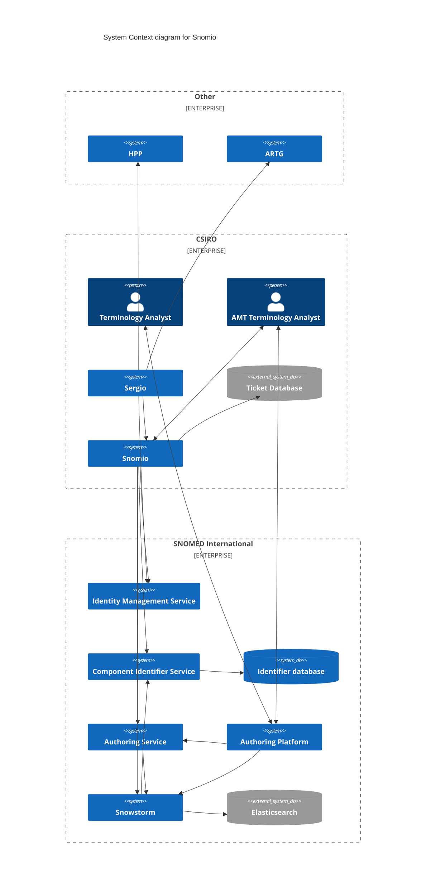

# Snomio
An integration with Snomed International's Authoring Platform that extends functionality to improve authoring of medicinal terminology.

To run this project 

cookies for the .ihtsdotools domain are only shared one the same domain so you will need to
add snomio.ihtsdotools.org & snomio-api.ihtsdotools.org to your /etc/hosts file

```
cd ui
npm install
npm run dev
cd api
mvn spring-boot:run
```

To build you will need to pass ims-username and ims-password as VM arguments eg

```
mvn clean package -Dims-username=myusername -Dims-password=mypassword
```

## License

This project uses the Apache License 2.0.

To read more on it see [LICENSE](./LICENSE)

## Contributing

Contributions are always welcome!

See [contributing.md](./contributing.md) for ways to get started.

## Code of conduct

Please adhere to this project's [code_of_conduct.md](./code_of_con:q!duct.md).



