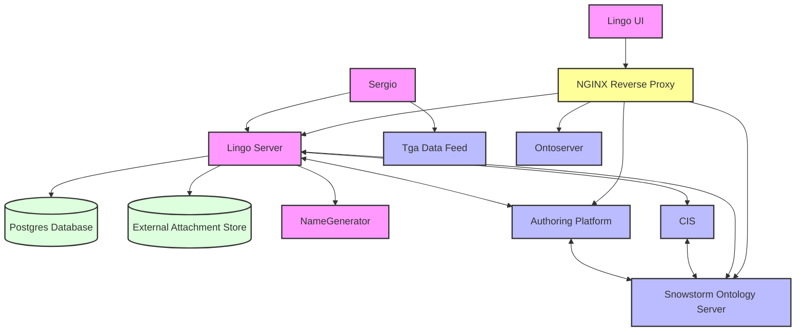

# Deployment Guide

## Purpose

This document covers deployment considerations and details including

- infrastructure requirements
- deployment overview (diagram with explanatory text)
- required operations and maintenance procedures
- monitoring
- backup
- disaster recovery

This is intended to document deployment of the software in general to help plan a new deployment or
update a deployment if a new version of the software is released that changes deployment
requirements. It does not document not the specifics of any particular deployment.

## Infrastructure requirements

Lingo is a reasonably lightweight application, and consists of two parts

- the ticketing system
- the product authoring features

### Deployment form

Lingo is built as a Docker image which is available as `amd64` and `arm64` for deployment on either
architecture.

### Disk requirements

Lingo has very little disk requirement as a container, and aside from storing attachments for
tickets requires minimal disk and no backups.

For ticket attachments Lingo requires a persistent volume mount with sufficient disk space to store
the projected size of attachments your tickets will require. Lingo does store single copies of
unique files, so that if the same file is attached to multiple tickets only one copy will be stored
to minimise disk use.

### Database

Lingo requires a database to store ticket data and metadata. The database required is Postgres,
which may be a container, cloud platform service, or externally hosted server.

Database size is relative to the number of tickets you intend to store. For reference a database
with 50,000 tickets is ~700MB.

## External Dependencies

To deploy Lingo you will need

- A SNOMED International Managed Service instance, specifically
    - Snowstorm
        - used to search and update terminology content
    - Authoring Service
        - used to search and create Authoring Platform Tasks
    - IMS
        - used to authenticate and authorise users, and authenticate to Managed Service interfaces
    - CIS
        - used to allocate identifiers for bulk concept creation requests - Lingo will fall back
          to sequential concept creation if this is not present
- An Ontoserver instance
    - used to accelerate search response time by getting fast responses from Ontoserver for released
      content and combining that with requests to Snowstorm for unreleased content

Optionally you can deploy a name generator. Lingo supports an SPI it calls when new names are
required for a new concept. If you have a name generator that implements this SPI it can be plugged
into Lingo, however Lingo will work without the additional name generator it just won't generate
suggested names for new concepts.

Any serious deployment of Lingo will use a reverse proxy in front of Lingo for security and
SSL/TLS (Lingo does not do SSL/TLS itself). Often deployed in terms of a Kubernetes cluster this is
achieved using an ingress controller.

## Deployment overview

The diagram below shows the main components in the deployment and how they are connected.
<!-- @formatter:off -->




Lingo uses a reverse proxy to make it easier to talk to snowstorm & the authoring platform without having cors errors.

If you wanted to see how a basic setup looks like with docker-compose, one is available at [docker/docker-compose.yaml](../docker/docker-compose.yaml)
<!-- @formatter:on -->

## Operations and maintenance procedures

## Deploying upgrades

Deploying upgrades of Lingo is achieved by simply deploying a new Docker image and restarting the
container. Lingo uses [Flyway](https://flywaydb.org) to forward migrate the database schema with
any required changes on boot.

To ensure that rollback is simple, a database backup should be taken before deploying a new
version - Lingo does not have a feature to roll back any migrations it has done in deployment.

## Monitoring

Monitoring can be inplemented in multiple ways, and Lingo has a few ways in which this can be
achieved.

The most basic of all Lingo exposes the base endpoints
from [Springs Boots actuator](https://www.baeldung.com/spring-boot-actuators). To run a health check
on Lingos integrations you can send a GET request to the endpoint Lingo_location/api/status, which
will return json in the format

```
{
    "authoringPlatform": {
        "running": boolean,
        "version": string
    },
    "snowstorm": {
        "running": boolean,
        "version": string,
        "effectiveDate": string
    },
    "cis": {
        "running": boolean,
        "version": string
    }
}
```

These endpoints can be used whoever you please to enable monitoring.

Lingo also makes it easy to use [OpenTelemetry](https://opentelemetry.io/) , this can be configured
in application.properties

```
Lingo.telemetry.enabled=boolean
Lingo.telemetry.zipkinendpoint=your_endpoint
Lingo.telemetry.otelendpoint=your_endpoint
```

In a real deployment, something like Kubernetes will likely be used which can be uses to greatly
enhance monitoring. For example using a combination of Grafana and OpenTelemetry to provide easy
to use and detailed logs. As there are many ways to do this, and many monitoring tools, this won't
be covered here, however the Lingo container console logs and OpenTelemetry are the main
integration
points.

## Backup

Lingo has no in built backup system, a backup regime should be designed appropriate to the
deployment.
Creating a backup prior to deploying a new version is recommended, even though all new versions
should not be data destroying it's safer to err on the side of caution.

There are no specific recommendations for periodic backups, that is a deployment specific decision.

## Disaster recovery

Rollback the database to the latest working configuration. Restart (although this should not be
necessary) the application container.