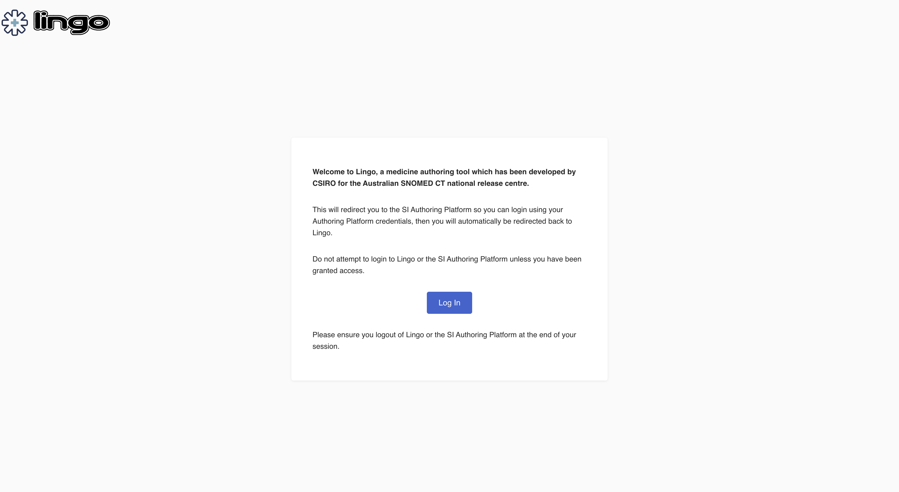
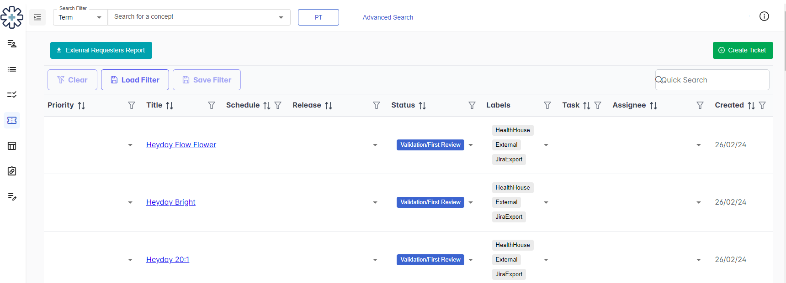

# Snomio User Guide

## Purpose

The purpose of this document is to provide a basic guide to the Snomio application for uninitiated
users.

The guide covers the following topics:

- how to get started (getting credentials, permissions etc),
- basic application concepts and orientation,
- core use cases and workflow

# Snomio

Snomio is a customised tool to manage Australian Medicines Terminology
(AMT) content requests, author medicines terminology, and manage complex
ECL-based reference sets. It is a web application which utilises Managed
Service for storing and processing the content, whilst providing a more
efficient and quality-assured authoring mechanism. This enables concepts
authored in Snomio to be accessible in the Authoring Platform.

## Snomio access

The credentials to access the Medicine Authoring Tool, Snomio, is the
same as for the AP. Role-based access for authoring terminology in
Snomio is the same as the access in the Australian Medicines Terminology
(AUAMT) project on the AP.

To log into Snomio:

1.  Go to the login page: <https://snomio.ihtsdotools.org/login>

1.  On the landing page, click on ***Log In***. This will direct the
    user to the AP landing page.

2.  Use SI login details to log into the application. The user will be
    redirected back to the Snomio page.

3.  The Snomio "My Tasks" screen is loaded.

## Ticket management

Snomio includes a ticket management system that contains the AMT work
tickets generated by the TGA/PBS Import Service. Each ticket represents
branded containerized product pack requiring creation, modification, or
deactivation within the AMT, and is managed by terminology authors.
Additionally, users can manually create tickets for products not
included in the current TGA dataset.

Once logged in, a dashboard is displayed. There are two main components
of ticket management on the dashboard view:

a.  **Backlog**: This section contains work tickets generated by the
    TGA/PBS Import Service or manually created by the content team. The
    table provides information such as priority, release, status of the
    ticket, and visual indicators indicating its association with a
    task.

{width="6.6930555555555555in"
height="2.4166666666666665in"}

b.  **Backlog Tables:** A condensed view of the AMT work tickets with
    specific filters available. Users can customise their dashboard by
    adding up to four tables to tailor their view according to their
    preferences.

### Backlog 

1.  Click on the ***Backlog*** icon on the banner bar to load the AMT
    work ticket.

2.  Filtering the backlog:

    a.  Apply a filter to a column

        i.  To apply filters to the backlog, click on the filter icon
            in the heading row for a
            column

        ii. Select one or more values (depending on the column) then
            click "X" and ***Apply***

    b.  Clear the filter for a column

        i.  Click on the filter
            in the heading row for a
            column

        ii. Click ***Clear***

    c.  Clear the filter and sorting for all columns

        i.  Click ***Clear*** above the backlog list

        ii. The list will immediately refresh with the default
            filter/sorting settings

    d.  Save a filter

        i.  Apply all filters and sorting required

        ii. Click ***Save Filter*** above the backlog list

        iii. Type in the filter name and click ***Add Filter***.
             Alternatively, select a filter name from the list to
             replace an existing filter and click ***Update Filter***.

        iv. If you decide you do not want to save the filter at the
            moment, press ESC or click anywhere on the original page to
            hide the "Save Filter" window.

    e.  Load a saved filter

        i.  Click ***Load Filter*** above the backlog list

        ii. Select a filter from the filter list

        iii. Click ***Apply Filter***

### Create a Ticket

1.  Click on the ***Backlog*** icon on the banner bar.

2.  A ticket can be manually created by clicking on the ***Create
    > Ticket*** button.

3.  Once a ticket is created, users can click on the ***EDIT*** buttons
    > to update the ticket with additional information provided by the
    > requestor.

4.  If the ticket is ready for authoring, a Task can be added in the
    > same window by clicking the ***Add Task*** button.

### Edit/Update a Ticket

1.  Click on the ***Backlog*** icon on the banner bar.

2.  Locate the ticket for editing by typing the title of the ticket into
    > the search box.

3.  Click on the ticket.

4.  Scroll through the ticket and click on ***EDIT*** next to the
    > sections that need to be updated.

5.  Click on "X" to close the ticket window.

Note: If a ticket is currently Closed then only a few fields can be
modified, and comments can be added. To edit all of the fields in a
ticket its **State** would need to be changed to a value other than
"Closed" first.

## Task Management

To begin authoring medicines terminology, a task must first be created
and linked to a AMT work ticket. Upon completion of authoring,
classification and validation processes can be executed within Snomio.
Subsequent steps involving classification/validation result assessment
and acceptance take place in the AP, alongside task review and
promotion.

Once logged in, a dashboard is displayed. There are three main
components of task management on the dashboard view:

1.  **My Tasks**: This section presents a list of tasks assigned to the
    current user. The table includes the status of each task.

2.  **All Tasks:** Here, users find a compilation of all open tasks in
    the AMT project. Like \"My Tasks,\" this table also indicates the
    status of each task.

3.  **Tasks Requiring Review:** This segment displays tasks flagged for
    review by other authors. Users can identify whether a review task
    has been claimed by another reviewer or if it is available for
    initiation.

### Creating a Task

1.  Click the ***My Tasks*** button on the banner bar.

2.  Click the ***Create Task*** button.

3.  Enter a task **Title** and enter a description (if required), then
    click the ***Create Task*** button.

### Adding a ticket to a Task

1.  Click the task's ID (which is a hyperlink) and then click on
    "Tickets" panel.

2.  Click the ***Add Ticket*** button.

3.  In the "Add Ticket Association" window, type part of the title of
    the desired ticket.

4.  Select the ticket and then click the ***Add Association*** button.

Note: A ticket may not appear in the list of tickets in the "Add Ticket
Association" window, if it is closed or has already been associated with
another open task. If the desired ticket cannot be located then navigate
to the "Backlog" screen, search for the ticket, and add the task via its
"Edit Ticket" screen.

### Adding multiple tickets to a Task

1.  Click the ***Backlog*** button.

2.  Click the ***Create Task*** button.

3.  Enter a task **Title** then click the ***Create Task*** button. Note
    the task number.

4.  Click the ***Bulk Edit*** button.

5.  Select all the tickets to be associated to the same task.

6.  In the **Task** dropdown list, select the Task number.

7.  Click the ***Update*** button.

8.  The selected tickets are now associated with the Task.

### Removing a ticket from a Task

1.  Open the Task.

2.  Click on the "Ticket" panel.

3.  Locate the ticket that needs to be removed.

4.  Click on the rubbish bin icon to remove the ticket from the Task.

5.  In the "Confirm Delete" window, click the ***Confirm*** button to
    remove the Ticket.

### Classification and Validation

Tasks can be classified and validated in Snomio. The classification and
validation results are viewable in the AP. Classification and validation
can only be performed on non-promoted tasks which are assigned to the
current user.

To run the classifier:

1.  Click the ***My Tasks*** button.

2.  Click the Task ID to open the Task Edit screen.

3.  Click the ***Classify*** button. A notification will appear stating
    classification has started. When classification is finished, another
    notification will appear.

4.  Classification results are available to view in AP by clicking on
    ***View Classification***.

5.  Once the classification results are reviewed in AP, click the
    ***Accept Classification Results*** button.

6.  The classification status of the task becomes "Saved".

To run validation:

1.  Click the ***My Tasks*** button.

2.  Click the Task ID to open the Task Edit screen.

3.  Click the ***Trigger Validation*** button to run validation against
    the task. A notification will appear stating the task has been
    queued for validation. When validation is finished, another
    notification will appear.

4.  Validation results are available to view in AP by clicking on
    ***View Validation***.

> Note: A new task needs to be created to fix any failed validations.

### Reviewing a Task 

All tasks submitted for review will be visible on the \"All Tasks\" page
in Snomio, marked with a \"Review\" status, and they will also populate
the \"Tasks Requiring Review\" page. In addition, if a task is assigned
to the user as the Reviewer, it will appear in the \"My Tasks\" screen
in Snomio.

To submit a task for review:

1.  Click the ***My Tasks*** button.

2.  Click the Task ID to open the Task Edit screen.

3.  Click the ***Submit for Review*** button. The task's status will
    change to "In Review" and the task will be displayed in the "Tasks
    Requiring Review" screen.

To cancel the review process for a task:

1.  Click the ***My Tasks*** button.

2.  Click the Task ID to open the Task Edit screen.

3.  Click the ***View in Authoring Platform*** button.

4.  Click the ***Cancel this Review*** button. The task's status will
    change to "In Progress" and the task will be removed from the "Tasks
    Requiring Review" screen in Snomio.

To review a task:

1.  Click the ***Tasks Requiring Review*** button on the banner bar.

2.  Click the Task ID for the task to be reviewed, to display the Task
    Edit screen.

3.  Click the ***View in Authoring Platform*** button.

4.  Complete the review in the Authoring Platform.

> Note: The task will be automatically assigned to user 1^st^ reviewer
> of the Task. The 2^nd^ reviewer will need to manually assign
> themselves as a reviewer in AP or Snomio.

## Create a product

When creating a product, a ticket needs to be created and associated
with an active task. Once the task is created, the product can then be
authored within the ticket on the task.

### Create a product from an existing product

1.  Open the task which the product needs to be created against.

2.  Click on the "Tickets" panel.

3.  Locate the ticket and click on the ticket to open it.

4.  Scroll to the \"Products\" section in the Edit Ticket panel and
    click the \"+\" button (create new product) above the product list.

5.  Search for the product in the \"Search for a concept\" field and
    select the product.

6.  Update the product as per the ticket's requirements.

7.  Click the ***Preview*** button to preview the concepts being
    created.

8.  Update any PTs and FSNs as required.

9.  Click the ***Create*** button to create the concepts.

### Create a product from scratch

1.  Open the task which the product needs to be created against.

2.  Click on the "Tickets" panel.

3.  Locate the ticket and click on the ticket to open it.

4.  Scroll to the \"Products\" section in the Edit Ticket panel and
    click the \"+\" button (create new product) above the product list.

5.  Under "Product Details", type in the Brand Name and select the
    correct brand name from the drop-down list.

6.  Add an ARTG ID where applicable.

7.  To add Contained Packages, click the "+" to add in Contained
    Packages detail.

8.  To add Contained Products, click the "+" to add in Contained
    Products detail.

9.  Click the ***Preview*** button to preview the concepts being
    created.

10. Update the PTs and FSNs as required.

11. Click the ***Create*** button to create the concepts.

## Complex ECL-based reference set management tool

A reference set tool has been developed to supplement the RT2 in
maintaining complex ECL-based reference sets. The tool is integrated
with SI Snowstorm, and its user interface is embedded into Snomio to
integrate with the shared Snomio/Authoring Platform user management and
authentication.

This tool provides 2 main features:

-   An ECL builder on the user interface to create or maintain the ECL
    queries for reference sets (results are saved against an AP
    authoring project).

-   Automatic overnight daily calculation of ECL-based reference set
    membership (results are saved against the mainline AP project). This
    process does not require interaction for standard daily activities.

### ECL Builder

To create an ECL-based reference set:

1.  Create a task in AP under the AUAMT or AUSCT project.

2.  Create a new concept with the following details:

    i.  **FSN:** *\<name of reference set\>* (foundation metadata
        > concept)

    ii. **AU-preferred Synonym:** *\<name of reference set\>*

    iii. **Axiom:** "is a" \| Simple type reference set (foundation
         > metadata concept) \| 446609009 \|

3.  Save the concept and run the classification.

4.  Save the classification results and return to Snomio.

5.  Click the ***ECL Refset Tool*** icon on the banner bar.

6.  The "ECL Refset Tool" page is loaded and the "My Tasks" list is
    displayed.

> 

1.  Select the task created in Step 1, to open the task.

1.  Click the ***Create*** button.

2.  Search for and select the concept created in Step 2.

3.  Use the "ECL Expression Builder" section to set the ECL query.

4.  Review the changes of membership by clicking on the ***Preview***
    button.

5.  When finished modifying the ECL query, click the ***Create*** button
    to commit the changes.

6.  To promote the changes made to the ECL query:

    i.  Log into the AP.

    ii. Locate the ECL task under the AUAMT or AUSCT project that it was
        > created under.

    iii. Promote the task to project.

To edit an ECL-based reference set:

1.  Create a task in AP under the AUAMT or AUSCT project.

2.  Click the ***ECL Refset Tool*** icon on the banner bar.

3.  The "ECL Refset Tool" page is loaded and the "My Tasks" list is
    displayed.

4.  Select the task created in Step 1, to open the task.

5.  Click one of the reference sets in the "Query Reference Sets" list.

6.  Click the ***Edit ECL*** button.

7.  Use the "ECL Expression Builder" section to modify the ECL query.

8.  Review the changes of membership by clicking the ***Preview***
    button.

9.  When finished modifying the ECL query, click the ***Update*** button
    to commit the changes.

10. To promote the changes made to the ECL query:

    i.  Log into the AP.

    ii. Locate the ECL task under the AUAMT or AUSCT project that it was
        > created under.

    iii. Promote the task to the project.

### Automatic calculation of ECL reference set membership

All reference sets based on ECL undergo automatic membership
recalculation daily overnight. For newly-created reference sets, or
reference sets which have just had their ECL query modified, their
parent project (AUAMT or AUSCT) must be promoted to mainline before they
will be included in the overnight membership recalculation.

If the automated updates to a particular reference set exceed the
predefined limit (i.e. more than 5% change or 2000 members added to the
reference set), a report will be dispatched to the NCTS Content mailbox.
In such cases, updates to the affected reference set will be halted
until a terminologist reviews the changes and applies a flag to
authorise the membership update.