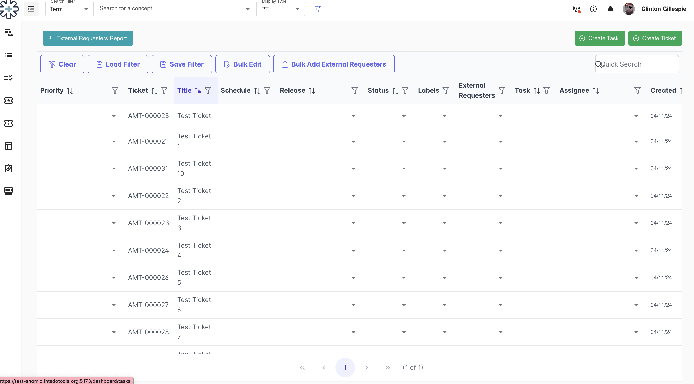

# Lingo User Guide

## Purpose

The purpose of this document is to provide a basic guide to the Lingo application for uninitiated
users.

The guide covers the following topics:

- how to get started (getting credentials, permissions etc),
- basic application concepts and orientation,
- core use cases and workflow

## Assumptions

The document assumes that you have access to AMT, or some other extension that models medicinal
content in the same manner.

# Lingo

Lingo is a customised tool to manage Medicines Terminology content requests, author medicines
terminology, and manage complex ECL-based reference sets. It is a web application which utilises
Managed Service for storing and processing the content, whilst providing a more efficient and
quality-assured authoring mechanism. This enables concepts authored in Lingo to be accessible in
the Authoring Platform (AP).

## Lingo access

The credentials to access the Medicine Authoring Tool, Lingo, are the same as for the AP. Role-based
access for authoring terminology in Lingo is the same login as your access to the authoring
platform.

Users must first register with SNOMED International for access to the Authoring Platform, and
their AP account must be given permission to access the project which Lingo has been configured
for.

To log into Lingo:

1. Go to the login page: <https://YOUR_LINGO_DOMAIN.ihtsdotools.org/login>

2. On the landing page, click on ***Log In***. This will direct the
   user to the AP landing page.

3. Use SI login details to log into the application. The user will be
   redirected back to the Lingo page.

4. The Lingo "My Tasks" screen is displayed, showing all of the tasks in the Authoring Platform
   which are assigned to the current user.

## Ticket management

Lingo includes a ticket management system. Each ticket ideally represents some form of content to
be authored - but it could be general workflow items. Users can manually create, update, and delete tickets.

Once logged in, a dashboard is displayed. There are three main components of ticket management on the
dashboard view:

a.  **Backlog**: This section contains work tickets generated by the team. The table provides
information such as priority, release, status of the ticket, and visual indicators indicating its
association with a task.

b.  **My Backlog:** A pre-filtered view of the backlog, set to only show open tickets which have 
been assigned to the current user.

c.  **Backlog Tables:** A condensed view of the work tickets with specific filters available. Users
can customise their dashboard by adding up to four tables to tailor their view according to their
preferences.

### Backlog

1. Click on the ***Backlog*** icon on the toolbar to load the work ticket.

2. Filtering the backlog:

    a. Apply a filter to a column

        i.  To apply filters to the backlog, click on the filter icon
        in the heading row for a column

        ii. Select one or more values (depending on the column) then
        click "X" and ***Apply***

    b. Clear the filter for a column

        i.  Click on the filter in the heading row for a column

        ii. Click ***Clear***

    c. Clear the filter and sorting for all columns

        i.  Click ***Clear*** above the backlog list

        ii. The list will immediately refresh with the default
           filter/sorting settings

    d. Save a filter

        i.  Apply all filters and sorting required

        ii. Click ***Save Filter*** above the backlog list

        iii. Type in the filter name and click ***Add Filter***.
            Alternatively, select a filter name from the list to
            replace an existing filter and click ***Update Filter***.

        iv. If you decide you do not want to save the filter at the
           moment, press ESC or click anywhere on the original page to
           hide the "Save Filter" window.

    e. Load a saved filter

        i.  Click ***Load Filter*** above the backlog list

        ii. Select a filter from the filter list

        iii. Click ***Apply Filter***

### Create a Ticket

1. Click on the ***Backlog*** icon on the toolbar.

2. A ticket can be manually created by clicking on the ***Create Ticket*** button and entering a Title.

3. Once a ticket is created, users can click on the ***EDIT*** buttons to update the ticket with
   additional information provided by the requestor.

4. If the ticket is ready for authoring, a Task can be associated with the ticket in the same window by 
   clicking the ***Add Task*** button.

### Edit/Update a Ticket

1. Click on the ***Backlog*** icon on the toolbar.

2. Locate the ticket for editing by typing the title of the ticket into the search box.

3. Click on the ticket.

4. Scroll through the ticket and click on ***EDIT*** next to the sections that need to be updated.

5. Click on "X" to close the ticket window.

Note: If a ticket is currently Closed then only a few fields can be
modified, and comments can be added. To edit all the fields in a
ticket its **State** would need to be changed to a value other than
"Closed" first.

## Task Management

To begin authoring medicines terminology, a task must first be created
and linked to a work ticket. Upon completion of authoring,
classification and validation processes can be executed within Lingo.
Subsequent steps involving the assessment and acceptance of 
classification/validation results take place in the AP, alongside task 
review and promotion.

Once logged in, a dashboard is displayed. There are three main
components of task management on the dashboard view:

1. **My Tasks**: This section presents a list of open tasks assigned to 
   the current user, or where the current user has been nominated as a
   reviewer. The table includes the status of each task.

3. **All Tasks:** Here, users find a compilation of all open tasks in
   the project. Like \"My Tasks\", this table also indicates the
   status of each task.

4. **Tasks Requiring Review:** This segment displays tasks flagged for
   review by other authors. Users can identify whether a review task
   has been claimed by another reviewer or if it is available for
   initiation.

### Creating a Task

1. Click the ***My Tasks*** button on the toolbar.

2. Click the ***Create Task*** button.

3. Enter a task **Title** and enter a description (if required), then
   click the ***Create Task*** button.

### Adding a ticket to a Task

1. Click the task's ID (which is a hyperlink) and then click on the
   "Tickets" panel.

2. Click the ***Add Ticket*** button.

3. In the "Add Ticket Association" window, type part of the title of
   the desired ticket.

4. Select the ticket and then click the ***Add Association*** button.

Note: A ticket may not appear in the list of tickets in the "Add Ticket
Association" window, if it is closed or has already been associated with
another open task. If the desired ticket cannot be located then navigate
to the "Backlog" screen, search for the ticket, and add the task via its
"Edit Ticket" screen.

### Adding multiple tickets to a Task

1. Click the ***Backlog*** button.

2. Click the ***Create Task*** button.

3. Enter a task **Title** then click the ***Create Task*** button. Note
   the task number.

4. Click the ***Bulk Edit*** button.

5. Select all the tickets to be associated to the same task.

6. In the **Task** dropdown list, select the Task number.

7. Click the ***Update*** button.

8. The selected tickets are now associated with the Task.

### Removing a ticket from a Task

1. Open the Task.

2. Click on the "Ticket" panel.

3. Locate the ticket that needs to be removed.

4. Click on the rubbish bin icon to remove the ticket from the Task.

5. In the "Confirm Delete" window, click the ***Confirm*** button to
   remove the Ticket.

Alternatively, a ticket can be disassociated from a Task using the 
Edit Ticket panel:
1. Click the ***Backlog*** button.

2. Click the filter icon in the "Task" column heading.

3. Set the filter to "Equals" and search for and select the relevant Task.

4. Click the ***Apply*** button to filter the list of tickets.

5. Locate the ticket that needs to be removed from the Task and click its
   title to show the Edit Ticket panel.

6. Click the ***EDIT*** button in the Additional Fields section of the
   Edit Ticket panel.

7. Click the delete button to the right of the **Task** field and click
   ***Delete*** in the confirmation message.

### Classification and Validation

Task classification and validation can be initiated from within Lingo. 
The classification and
validation results are viewable in the AP. Classification and validation
can only be performed on non-promoted tasks which are assigned to the
current user.

To run the classifier:

1. Click the ***My Tasks*** button.

2. Click the Task ID to open the Task Edit screen.

3. Click the ***Classify*** button. A notification will appear stating
   classification has started. When classification is finished, another
   notification will appear.

4. Classification results are available to view in AP by clicking on
   ***View Classification***.

5. Once the classification results are reviewed in AP, click the
   ***Accept Classification Results*** button within AP.

6. The classification status of the task becomes "Saved".

To run validation:

1. Click the ***My Tasks*** button.

2. Click the Task ID to open the Task Edit screen.

3. Click the ***Trigger Validation*** button to run validation against
   the task. A notification will appear stating the task has been
   queued for validation. When validation is finished, another
   notification will appear.

4. Validation results are available to view in AP by clicking on
   ***View Validation***.

### Reviewing a Task

All tasks submitted for review will be visible on the \"All Tasks\" page
in Lingo, marked with an \"In Review\" status, and they will also populate
the \"Tasks Requiring Review\" page. In addition, if a task is assigned
to the user as the Reviewer, it will appear in the \"My Tasks\" screen
in Lingo.

To submit a task for review:

1. Click the ***My Tasks*** button.

2. Click the Task ID to open the Task Edit screen.

3. Click the ***Submit for Review*** button. The task's status will
   change to "In Review" and the task will be displayed in the "Tasks
   Requiring Review" screen.

To cancel the review process for a task:

1. Click the ***My Tasks*** button.

2. Click the Task ID to open the Task Edit screen.

3. Click the ***View in Authoring Platform*** button.

4. Click the ***Cancel this Review*** button. The task's status will
   change to "In Progress" and the task will be removed from the "Tasks
   Requiring Review" screen in Lingo.

To review a task:

1. Click the ***Tasks Requiring Review*** button on the toolbar.

2. Click the Task ID for the task to be reviewed, to display the Task
   Edit screen.

3. Click the ***View in Authoring Platform*** button.

4. Complete the review in the Authoring Platform.

> Note: When the first non-owner user accesses the task while it is
> "In Review", they will be automatically listed as the first reviewer.
> The second reviewer will need to manually assign
> themselves as a reviewer in AP or Lingo.

## Create a product

When creating a product, a ticket needs to be created and associated
with an active task. Once the task is created, the product can then be
authored within the ticket on the task.

### Create a product from an existing product

1. Open the task which the product needs to be created against.

2. Click on the "Tickets" panel.

3. Locate the ticket and click on the ticket to open it.

4. Scroll to the \"Products\" section in the Edit Ticket panel and
   click the \"+\" button (create new product) above the product list.

5. Search for and select the existing product using the \"Search for a concept\"
   field.

7. Update the product as per the ticket's requirements.

8. Click the ***Preview*** button to preview the concepts being
   created.

9. Update any PTs and FSNs as required.

10. Click the ***Create*** button to create the concepts.

### Create a product from scratch

1. Open the task which the product needs to be created against.

2. Click on the "Tickets" panel.

3. Locate the ticket and click on the ticket to open it.

4. Scroll to the \"Products\" section in the Edit Ticket panel and
   click the \"+\" button (create new product) above the product list.

5. Under "Product Details", type in the Brand Name and select the
   correct brand name from the drop-down list.

6. Add an ARTG ID where applicable.

7. To add Contained Packages, click the "+" to add in Contained
   Packages detail.

8. To add Contained Products, click the "+" to add in Contained
   Products detail.

9. Click the ***Preview*** button to preview the concepts being
   created.

10. Update the PTs and FSNs as required.

11. Click the ***Create*** button to create the concepts.

## Snodine: Complex ECL-based reference set management tool

A reference set tool has been developed to supplement the RT2 in
maintaining complex ECL-based reference sets. The tool is integrated
with SI Snowstorm, and its user interface is embedded into Lingo to
integrate with the shared Lingo/Authoring Platform user management and
authentication.

This tool provides 2 main features:

- An ECL builder on the user interface to create or maintain the ECL
  queries for reference sets (results are saved against an AP
  authoring project).

- Automatic overnight daily calculation of ECL-based reference set
  membership (results are saved against the mainline AP project). This
  process does not require interaction for standard daily activities.

### ECL Builder

To create an ECL-based reference set:

1. Create a task in AP under your project.

2. Create a new concept with the following details:

   i.  **FSN:** *\<name of reference set\>* (foundation metadata concept)

   ii. **preferred Synonym:** *\<name of reference set\>*

   iii. **Axiom:** "is a" \| Simple type reference set (foundation metadata
   concept) \| 446609009 \|

3. Save the concept and run the classification.

4. Save the classification results and return to Lingo.

5. Click the ***Snodine*** icon in the toolbar.

6. The "Snodine" page is loaded and the "My Tasks" list is displayed.

> 

7. Select the task created in Step 1, to open the task.

8. Click the ***Create*** button.

9. Search for and select the concept created in Step 2.

10. Use the "ECL Expression Builder" section to set the ECL query.

11. Review the changes of membership by clicking on the ***Preview***
   button.

12. When finished modifying the ECL query, click the ***Create*** button
   to commit the changes.

13. To promote the changes made to the ECL query:

    i. Click the ***My Tasks*** icon in the toolbar.

    ii. Locate and click on the task that the reference set was created under.

    iii. Click the ***View In Authoring Platform*** button.

    iv. Click the ***Promote This Task to the Project*** button.

To edit an ECL-based reference set:

1. Create a task in the "My Tasks" screen.

2. Click the ***Snodine*** icon in the toolbar.

3. The "Snodine" page is loaded and the "My Tasks" list is
   displayed.

4. Select the task created in Step 1, to open the task.

5. Click one of the reference sets in the "Query-Based Reference Sets" list.

6. Click the ***Edit ECL*** button.

7. Use the "ECL Expression Builder" section to modify the ECL query.

8. Review the changes of membership by clicking the ***Preview***
   button.

9. When finished modifying the ECL query, click the ***Update*** button
   to commit the changes.

10. To promote the changes made to the ECL query:

    i. Click the ***My Tasks*** icon in the toolbar.

    ii. Locate and click on the task that the reference set was created under.

    iii. Click the ***View In Authoring Platform*** button.

    iv. Click the ***Promote This Task to the Project*** button.

### Automatic calculation of ECL reference set membership

All reference sets based on ECL undergo automatic membership
recalculation daily overnight if the Snodine update service has 
been configured to run on a schedule. For newly-created reference sets, or
reference sets which have just had their ECL query modified, their
parent project must be promoted to mainline before they
will be included in the overnight membership recalculation.

If the automated updates to a particular reference set exceed the
predefined limit (i.e. more than 5% change or 2000 members added to the
reference set), a report will be dispatched to an email address specified 
in the Lingo environment configuration.
In such cases, updates to the affected reference set will be halted
until a terminologist reviews the changes and applies a flag to
authorise the membership update.

### System Settings
Users can maintain the following system settings from within the Lingo UI:
- Ticket Labels
- Ticket Releases
- External Requesters

These settings use a common UI for maintaining their values.
To access them:
1. Click on the user's name in the top-right corner of the screen.

2. Click the "System Settings" panel heading.

3. Select one of the data types to be maintained (Labels, Releases,
   or External Requesters).  A list of the existing records will be displayed.
   
4. Click the ***Create*** button in the top-right corner of the screen
   to add a new record.
   
5. For an existing record in the list, click the pencil icon on the right
   side of the row to modify the properties of the record.
   
6. Click the delete icon on the right side of a row to delete a record.
   A confirmation message will be displayed.

7. After leaving the settings screen, the new list of values will immediately
   be available in the other screens within Lingo.
