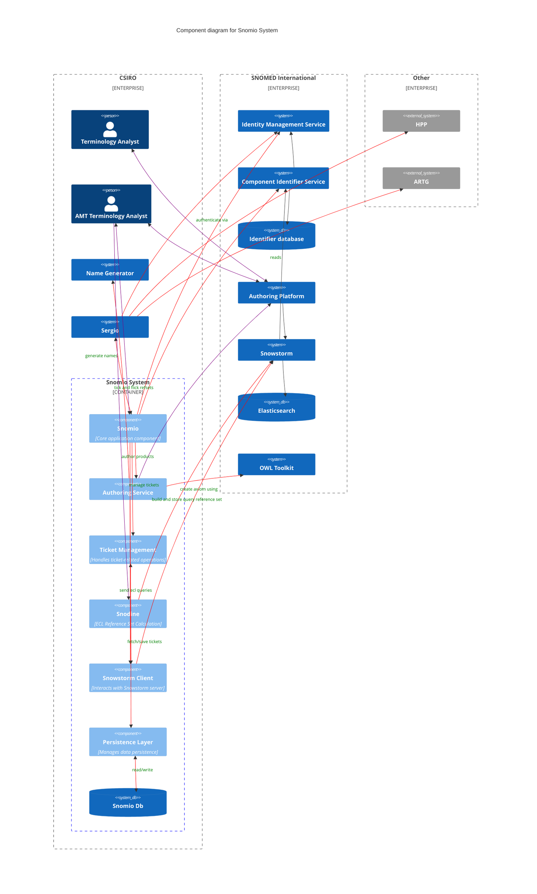

# Snomio Application Components

## Purpose

The purpose of this document is to provide an overview of the key components of the Snomio
application, and how they relate to each other. This is intended to provide a high-level
understanding of the application architecture for developers who are new to the project, or who are
looking to understand the overall structure of the system.

## Key Components

TODO diagram with Snomio, Ticket management, Snowstorm client, OWL toolkit, Sergio, ECL
reference set calculation, persistence layer. Should also show data store and data flow between
components.

TODO: describe each component in more detail

