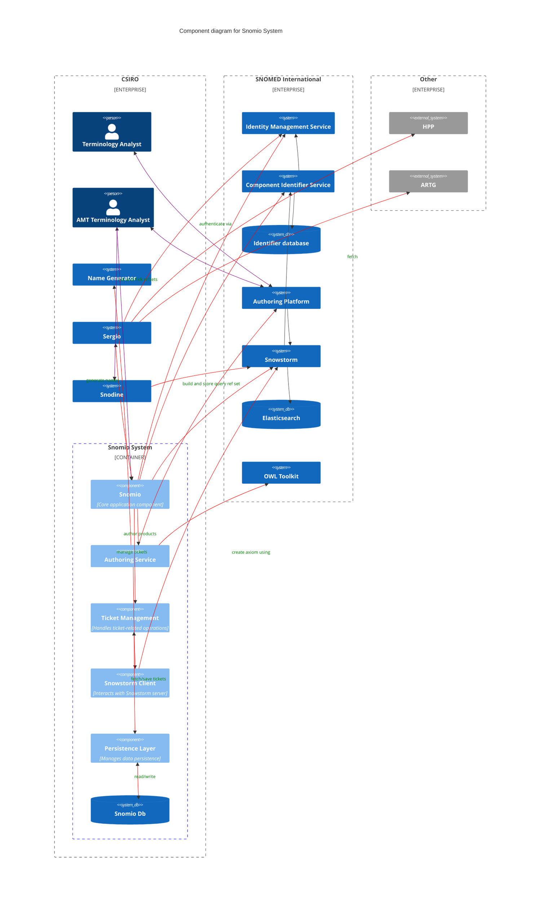

# Snomio Application Components

## Purpose

The purpose of this document is to provide an overview of the key components of the Snomio
application, and how they relate to each other. This is intended to provide a high-level
understanding of the application architecture for developers who are new to the project, or who are
looking to understand the overall structure of the system.

## Key Components

TODO diagram with Snomio, Ticket management, Snowstorm client, OWL toolkit, Sergio, ECL
reference set calculation, persistence layer. Should also show data store and data flow between
components.

TODO: describe each component in more detail

## Ticket management
Manages ticket handling within the Snomio system, including creating and updating tickets in the Snomio database. Tickets may also be modified by the Sergio import process.

## Snowstorm client
Functions as a client code layer to interact with SNOMED Snowstorm from the Snomio backend system. ECL queries from Snomio are processed through this client, supporting GET, POST, PUT, and DELETE operations.

## OWL toolkit
The OWL Toolkit is a library that enables conversion between SNOMED CT's tabular relationships format and OWL, and vice versa. Snomio use it to generate axioms that are then fed into the name generator.

## Sergio
The Sergio process handles TGA feeds, creating or modifying the relevant tickets for each ARTG ID in the Snomio database.

## Snodine
This is where the ECL Refset Tool comes in, allowing users to build queries for reference sets and save them against concepts within Snowstorm. While Snowstorm doesn't process these concepts directly, Snodine's overnight process identifies all of these refset concepts and reruns their queries. It then compares the updated list of concepts to the existing tick-and-flick refset, adding any newly created concepts and removing those that have been deactivated. As a result, the query-based refsets are converted into tick-and-flick style refsets, which can be accessed using RT2, and are maintained by Snodine's overnight process.

## Name generator

The Name Generator is an SPI server used during the authoring phase to generate product names based on a trained model and a given input set, which includes axioms and other relevant data.