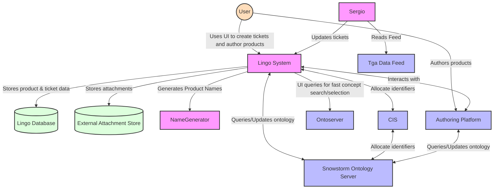
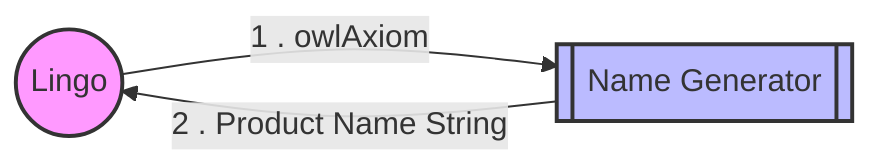
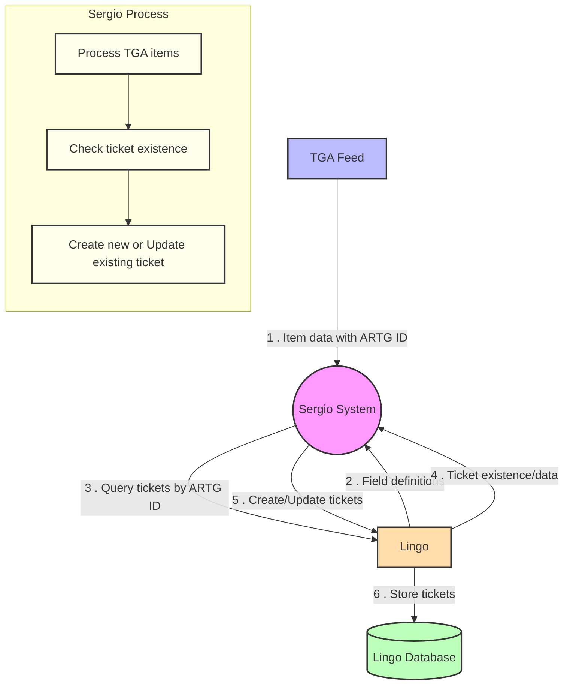
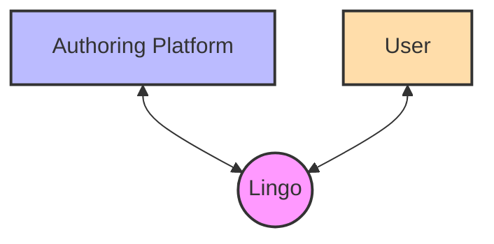
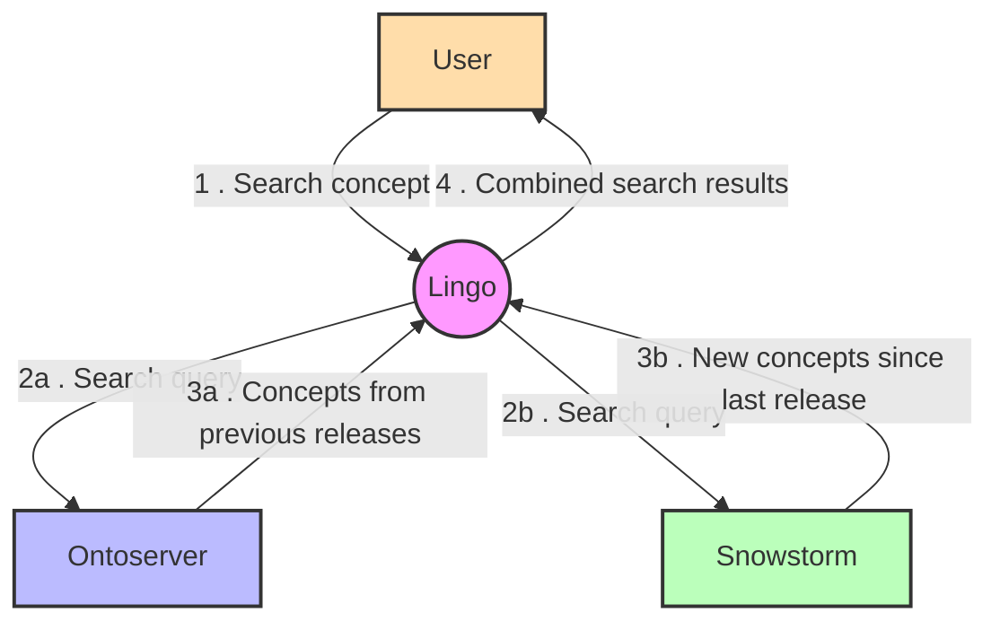
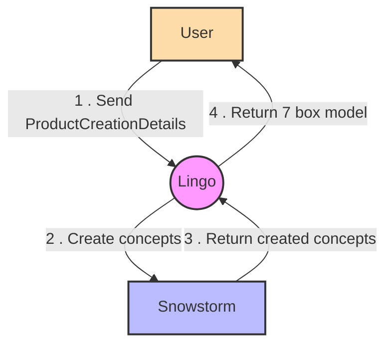
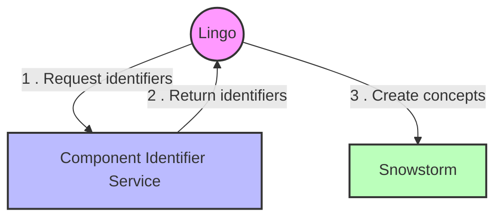

# Lingo integration points

## Purpose

This documentation provides an overview of the integration points between the Lingo application and
external systems including:

- the name generation SPI
- the Snowstorm ontology server
- the OWL toolkit
- the Sergio service
- the Authoring Platform
- the Component Identifier Service
- Ontoserver

### Overview

The System Context Diagram below displays the basic interactions between a user and the systems, 
and their interactions between each other.

<!-- @formatter:off -->

<!-- @formatter:on -->

### Name Generator

The name generator interface is quite simple. Lingo sends a request containing an OWL axiom with SNOMED
Identifiers replaced with names of the concepts. The name generator responds with a suggested
preferred term and fully specified name for the concept.

While out of scope for Lingo's documentation, it is a good example of how Lingo can be extended to execute 
externalised processes to assist with terminology authoring.

### Sergio

Sergio is an external service that manages a set of tickets mirroring a selected set of products
from
the Australian Register of Therapeutic Goods (ARTG) database. It is used to create or modify the
relevant tickets for each ARTG ID in the Lingo database.

While out of scope for Lingo's documentation, it is a good example of how an externalised process
can be used to manage a set of tickets as an adaptor based on an external feed using Lingo's API.

### Authoring Platform

#### Tasks

Lingo uses the concept of tasks within the Authoring Platform to manage the authoring of content.
Basic functions are pulled through to the Lingo user interface so users can create tasks within the
authoring platform, and retrieve a list of existing tasks & their status', without needing to leave
the Lingo UI.

To author content, tickets in Lingo's ticket database reflecting the work to be done are associated
with a task and authored on that task. These tickets contain information required for authoring.

Once content has been authored these tasks can have classification and validation run against them, 
and can be assigned to other users for review.

Each task has a 'key' which points to a branch in Snowstorm that has content authored against it;
for more information refer to the [Snowstorm section](#snowstorm)

### Snowstorm

#### Snowstorm Search Concepts

Users search concepts through Lingo to use as a basis for authoring, or to just view the make up of
that medication.

To work around performance constraints in Snowstorm, Lingo uses a combination of Snowstorm and
Ontoserver to provide a fast search experience. This is achieved by using Ontoserver to search for
concepts that have been released, and Snowstorm for concepts that have been authored since the last
release.

These are searched concurrently and the results are combined to provide a single search result to the
user.

#### Author Concepts

Lingo is designed to calculate the set of concepts, their descriptions, reference set members, and
modelling required to represent a product.

Once a user confirms the proposed set of concepts to create, Lingo uses Snowstorm's bulk concept
creation APIs to create the concepts as quickly as possible.

### Ontoserver

#### Ontoserver Search Concepts

See [Snowstorm Search Concepts](#snowstorm-search-concepts)

### Component Identifier Service

To use Snowstorm's bulk concept creation APIs, Lingo needs to allocate identifiers for the concepts
it is creating. This is done by the Component Identifier Service (CIS). If the CIS is not available,
Lingo will fall back to sequential concept creation - which is a slower process, however the content 
created is the same in both scenarios.

