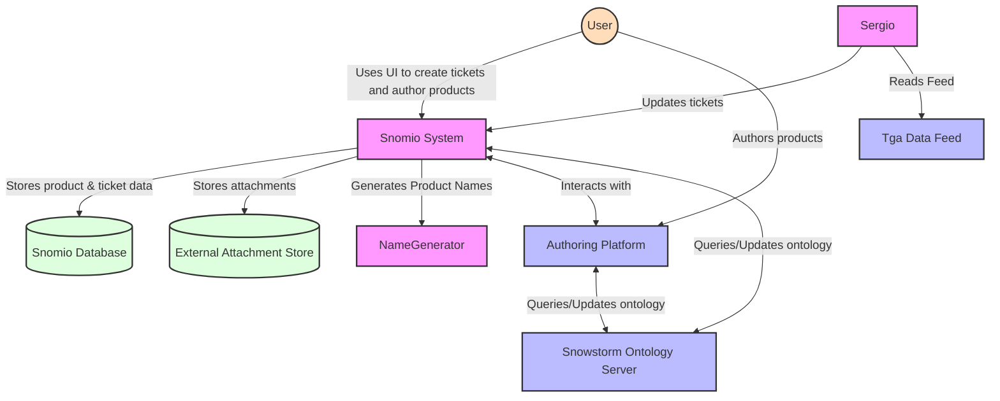
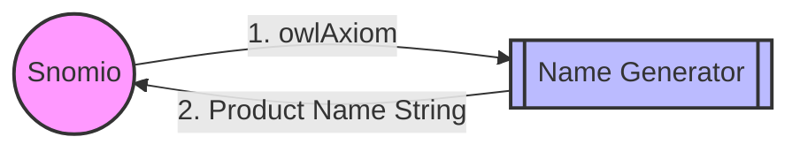
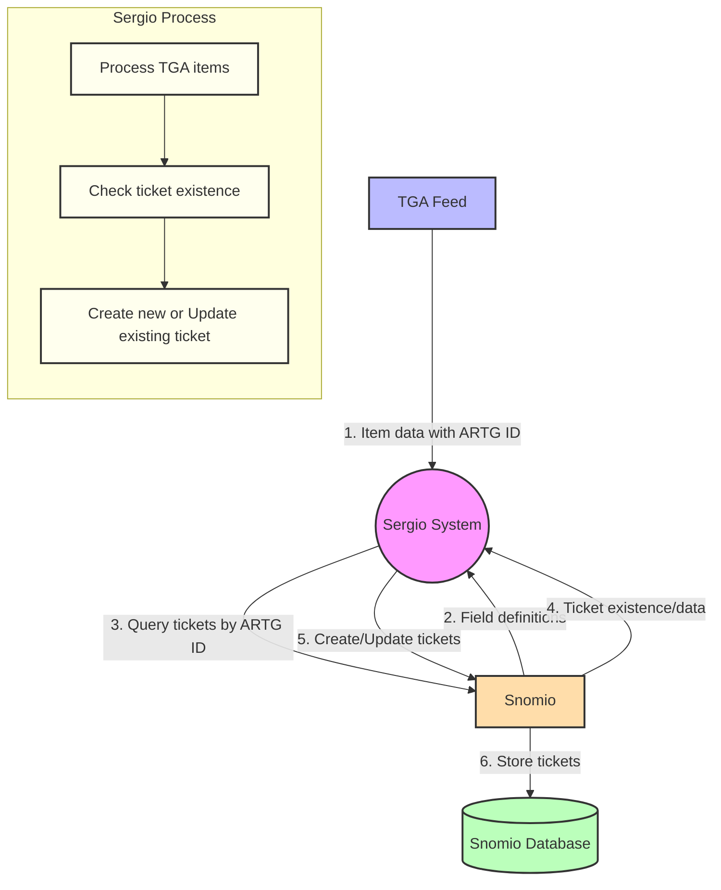

# Snomio integration points

## Purpose

This documentation provides an overview of the integration points between the Snomio application and
external systems including:

- the name generation SPI
- the Snowstorm terminology server
- the OWL toolkit
- the Sergio service
- the Authoring Platform
- the Component Identifier Service
- Ontoserver

### Overview
The below graph System Context Diagram displays the basic interactions between a user and the systems, and there interactions between eachother.

### Name Generator

### Sergio

TODO: describe each integration point in more detail including a diagram showing the data flow
between the Snomio application and the external system.