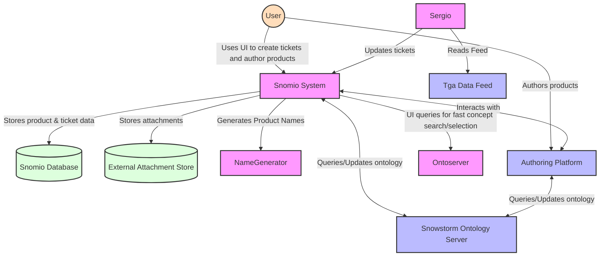
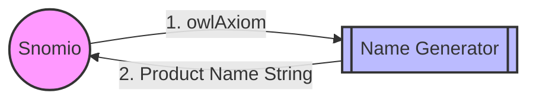
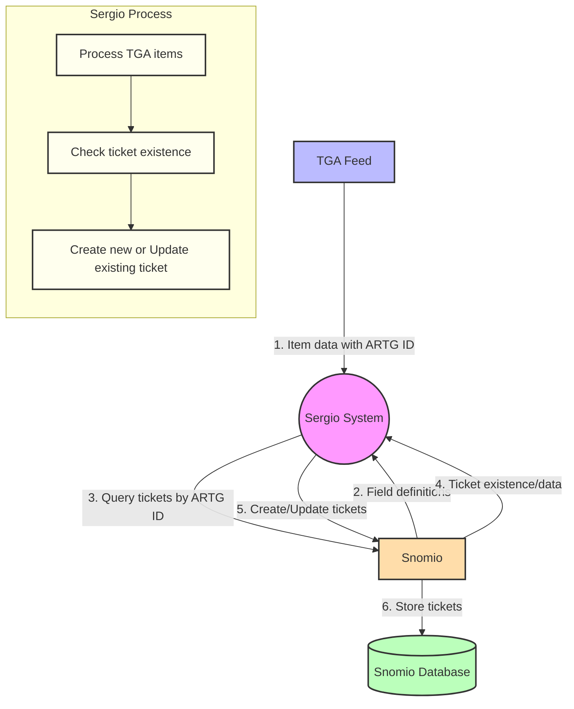
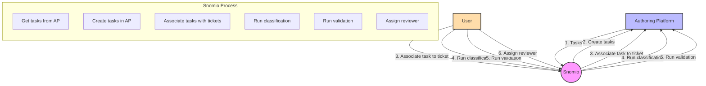
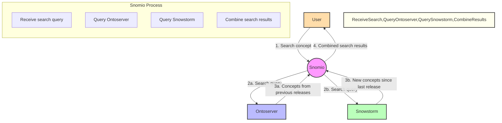
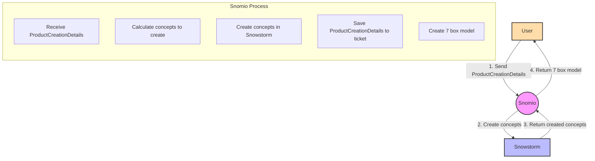

# Snomio integration points

## Purpose

This documentation provides an overview of the integration points between the Snomio application and
external systems including:

- the name generation SPI
- the Snowstorm terminology server
- the OWL toolkit
- the Sergio service
- the Authoring Platform
- the Component Identifier Service
- Ontoserver

### Overview

The below graph System Context Diagram displays the basic interactions between a user and the
systems, and there interactions between eachother.

### Name Generator

The name generator is quite simple, we send a request with what is in NameGeneratorSpec.java, and
get returned a string with a generated name.

### Sergio

### Authoring Platform

#### Tasks

Snomio uses the concepts of tasks within the authoring platform to enable the authoring of content.
Snomio can create tasks within the authoring platform, and retrieve a list of existing tasks & there
status'.

These tasks are then associated to a ticket - which contains information for authoring.

The tasks can then have content authored on them, and be assigned to users for review, and have
classification and validation ran against them.

These tasks have a 'key' which point to a branch in snowstorm that has content authored against it,
to read about that jump to the [Snowstorm Section](#snowstorm)

// TODO: I cannot figure out how to change the flow of this and the next diagram?

### Snowstorm

#### Snowstorm Search Concepts

Users search concepts through snomio to use as a basis for authoring, or to just view the make up of
that medication. We use two servers to achieve this - snowstorm for concepts authored since the last
published release, and ontoserver for all content including and before the last published release.

#### Author Concepts

Users author concepts through snomio - which talks to snowstorm and authors them within there, users
can then search these concepts in snomio once the task has been promoted.

### Ontoserver

#### Ontoserver Search Concepts

See [Snowstorm Search Concepts](#snowstorm-search-concepts)

### Component Identifier Service

Periodically reserves concept id's to speed up the process when a user goes to author a product - as
id's have already been reserved they can be passed to snowstorm in the create request, enabling the
bulk creation of new concepts that reference eachother.
