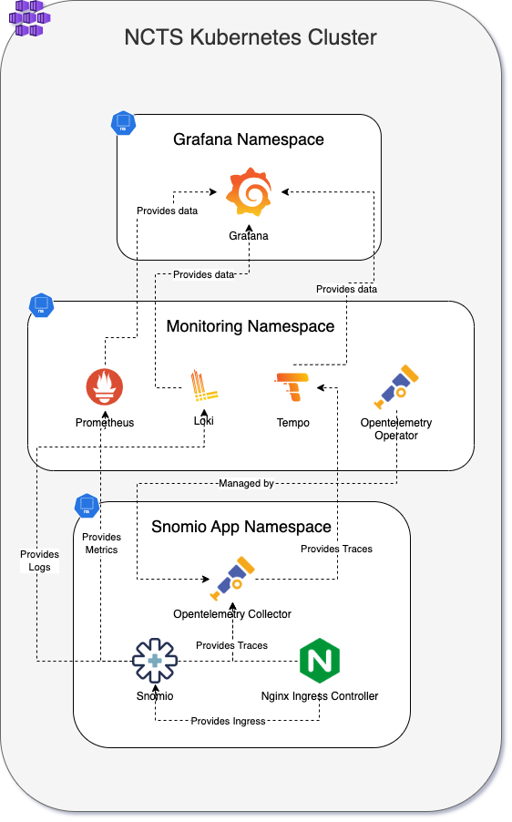
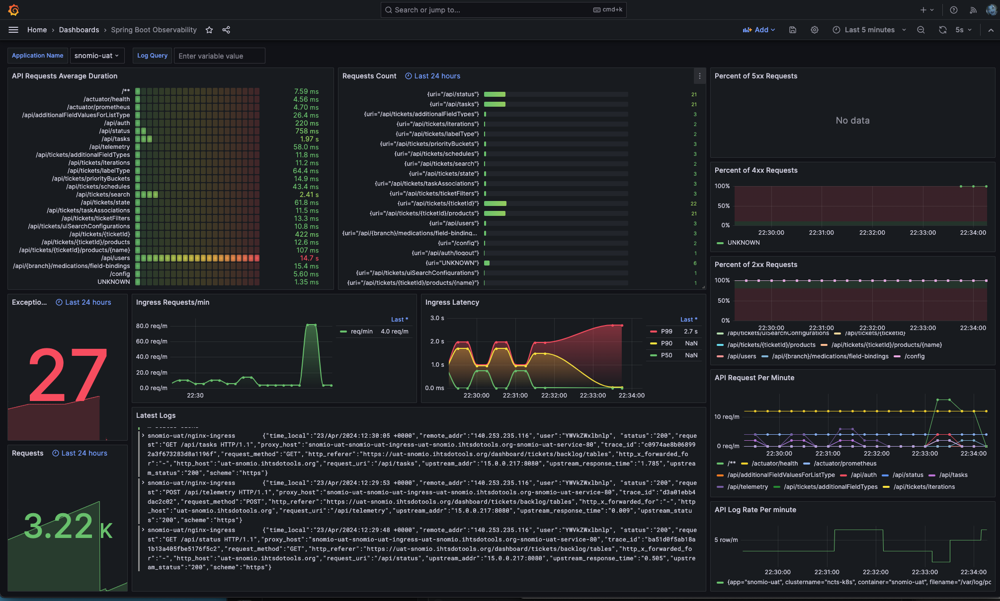

# Snomio OpenTelemetry Setup

### Overview

This document outlines the OpenTelemetry infrastructure setup for Snomio within the NCTS Kubernetes Cluster. The setup provides comprehensive observability for Snomio application by collecting, processing, and visualising telemetry data such as metrics, logs, and traces.

The following diagram describes the telemetry data flow and the installed components of the setup

### Component Overview

**Grafana Namespace:**

* **Grafana:** A visualisation tool that receives data from the various observability components (Prometheus, Loki, Tempo) to display metrics, logs, and traces in a user-friendly dashboard format.

**Monitoring Namespace:**

* **Prometheus:** An open-source monitoring solution that collects and stores metrics as time-series data.
* **Loki:** A horizontally-scalable, highly-available, multi-tenant log aggregation system.
* **Tempo:** A distributed tracing backend that ingests and stores traces.
* **OpenTelemetry Operator:** Manages the OpenTelemetry components and configurations within the entire Kubernetes cluster.

**Snomio App Namespace:**

* **Snomio:** The primary application being monitored. It generates telemetry data crucial for observability.
* **Nginx Ingress Controller:** Manages external access to the Snomio services, facilitating ingress of HTTP/S traffic into the application.
* **OpenTelemetry Collector:** Positioned within the Snomio App Namespace to gather metrics and traces directly from the Snomio application and logs from the Nginx Ingress Controller, which it then forwards to the relevant backends in the Monitoring Namespace.

Observability Data Flow

1. **Data Collection, Routing and Management:**
   * **Metrics:** Collected metrics are sent to Prometheus in the Monitoring Namespace.
   * **Logs:** Logs are forwarded to Loki, allowing for aggregation and querying of log data.
   * **Traces:** Traces are forwarded to the OpenTelemetry Collector and then passed onto Tempo, which specialises in storing and querying distributed them.
2. **Visualisation and Analysis:**
   * **Grafana:** Located in its dedicated namespace, Grafana pulls metrics from Prometheus, logs from Loki, and traces from Tempo. It presents this data in an integrated dashboard that provides real-time visibility into the operational state of the Snomio application.
3. **External Access:**
   * The Nginx Ingress Controller enables external traffic to access the Snomio application, ensuring that it is reachable for user interactions while also capturing ingress logs.

## Code Setup for OpenTelemetry Instrumentation

### Overview

The OpenTelemetry setup for the Snomio application involves configuring both the Spring Boot backend and the React frontend to send telemetry data to the OpenTelemetry Collector. The following sections describe the changes and configurations needed for each part of the application stack.

### Spring Boot Backend Configuration

For the Spring Boot application, the setup includes changes to `pom.xml` to bring in dependencies for Prometheus metrics and OpenTelemetry annotations, and a `TelemetryController` for forwarding UI telemetry data.

1. **Helm Chart for OpenTelemetry
   Instrumentation CRD:**
   Helm charts are used to add the OpenTelemetry Instrumentation Custom Resource Definition (CRD) for auto-instrumentation, which instructs the OpenTelemetry Operator on how to automatically inject instrumentation into the Java application pods.
   **ServiceMonitor CRD:**
   The ServiceMonitor CRD is configured for Prometheus to discover the metrics endpoint exposed by the Spring Boot application under the `/actuator/prometheus` path.
2. **Spring Boot `pom.xml` Changes:**
   The `pom.xml` file for the Spring Boot application is updated to include the `micrometer-registry-prometheus` dependency for Prometheus metrics collection and the `opentelemetry-instrumentation-annotations` for OpenTelemetry tracing.
3. **TelemetryController Implementation:**
   A `TelemetryController.java` is implemented to accept telemetry data from the React frontend via the `/api/telemetry` REST endpoint. It also includes and example and uses the `@WithSpan` annotation to create a new span or join an existing trace for methods marked with this annotation. It also adds the logged in user's username to the Span attributes using `@SpanAttribute`annotation.

### React Frontend Configuration

For the React frontend, changes include setting up the OpenTelemetry SDK to automatically instrument the web application and send trace data back to the backend.

1. **React UI Tracing Integration:**
   * `main.tsx` is modified to initialise OpenTelemetry instrumentation.
   * `Tracing.tsx` sets up the OpenTelemetry web instrumentation, including the`OTLPTraceExporter`, which sends trace data to the`/api/telemetry` endpoint provided by the backend.

### Nginx Ingress Configuration

The Nginx Ingress `ConfigMap` is adjusted to enable the collection of traces that the OpenTelemetry Collector can ingest. It also changes the log format to include OpenTelemetry TraceId.

### Automatic Instrumentation

With automatic instrumentation enabled through the use of Helm charts and OpenTelemetry SDK configurations, both the backend and the frontend are instrumented without requiring manual instrumentation code. The backend automatically captures telemetry data based on the Spring Boot framework activities, and the frontend does the same based on user interactions with the UI.

## Grafana Visualisation and Debugging

### Overview

Grafana serves as a powerful visualisation tool that aids in monitoring, visualising, and debugging the performance of the Snomio application. Through integration with Loki, Prometheus, and Tempo, Grafana aggregates logs, metrics, and traces into a comprehensive observability dashboard. This dashboard helps in assessing the application's health and performance and in pinpointing the root causes of issues.

### Grafana Dashboard: Spring Boot Observability

The Spring Boot Observability dashboard, as displayed in the provided screenshot, is a customised Grafana interface that presents various panels with metrics, logs, and traces data.

1. **API Requests Average Duration:**
   This panel visualises the average response time for API endpoints. It allows developers to quickly identify endpoints that are experiencing increased response times, which can be indicative of performance bottlenecks.
2. **Requests Count (Last 24 hours):**
   By showing the number of requests to each API endpoint, this panel provides insight into the load distribution across the application, helping to identify unusually high or low traffic patterns.
3. **Exceptions and Requests:**
   Here, exception counts and total request numbers are visualised, which is crucial for detecting and investigating errors and their impacts on the application usage.
4. **Ingress Latency:**
   Displays the latency metrics for incoming requests, offering a glimpse into the application's responsiveness from an end-user perspective.
5. **Percent of 5xx and 2xx Requests:**
   These panels display the proportion of successful (2xx) and error (5xx) responses, essential for overall health assessment and service reliability monitoring.
6. **API Request Per Sec:**
   This metric shows the throughput of the application, highlighting the application's capacity to handle incoming requests.
7. **Log Rate Per Minute:**
   Reflecting the volume of logs generated, this helps in understanding the application's logging patterns and can flag periods of unusual activity.

### Utilising Grafana for Performance and Debugging

* **Performance Visualisation:**
  Grafana pulls in Prometheus metrics to create a visual context for application performance monitoring. It can reveal trends, spikes, and anomalies in the application's behavior over time, making it easier to interpret how the application handles load and where optimisations may be necessary.
* **Debugging with Logs and Traces:**
  Integrating Loki allows Grafana to query and display logs alongside metrics, enabling developers to correlate log events with performance issues. Tempo's integration allows the exploration of trace data, which can be used to drill down into specific service interactions or request flows to diagnose problems.
* **Tempo Explore:**
  Within Grafana, Tempo's Explore option can be utilised to delve into traces that span across various services and infrastructure components, helping to isolate latency issues, errors, and cross-service anomalies.
  Here is a screeshot showing a Trace of a user interaction on the UI dri
* **Interactive Querying:**
  Grafana provides the capability to interactively query log and metric data using Loki and Prometheus, respectively. Developers can adjust queries to filter data, drill down to specific time ranges, or display logs related to specific trace IDs

### Conclusion

The integration of OpenTelemetry into the Snomio application stack provides a comprehensive and automated approach to collecting telemetry data. The use of Helm charts, CRDs, and SDK configurations streamline the setup process, allowing for a resilient and scalable observability solution. Grafana is used for visualisation and monitoring to help debug performance issues and errors within the Snomio application.
